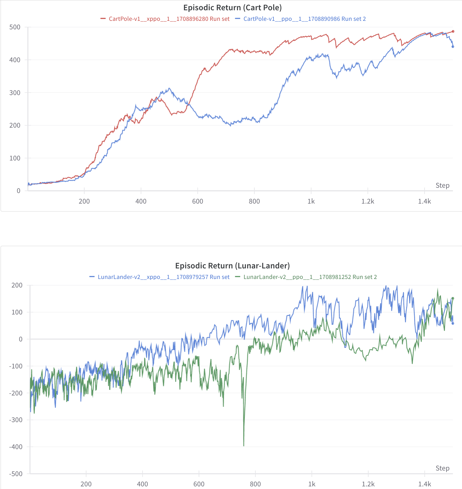

## About this work (in progress)
A study of regularized reinforcement learning algorithms from both a MaxEntRL and a Linear Programming framework.
### XPPO - variation of PPO

### XSAC - variations on extreme gumbel regression for SAC

### XTD3 - variations on extreme gumbel regression for TD3

