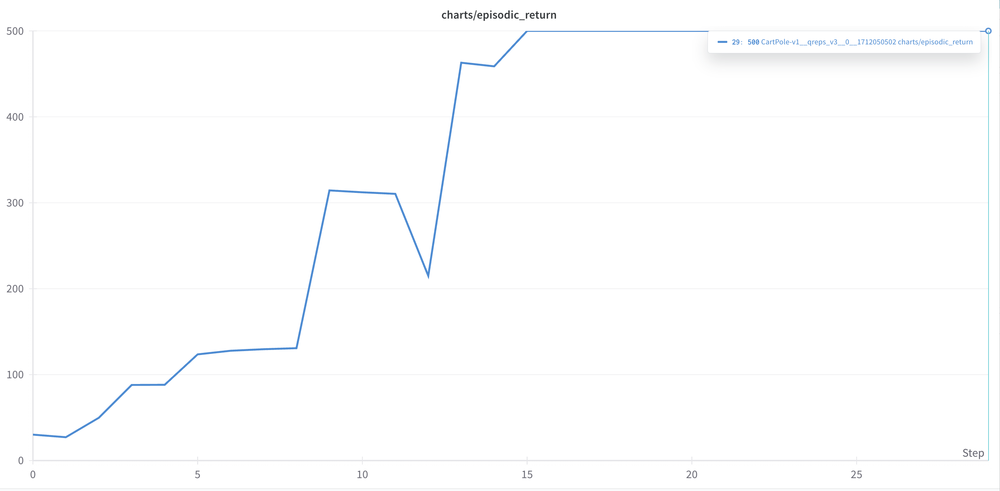
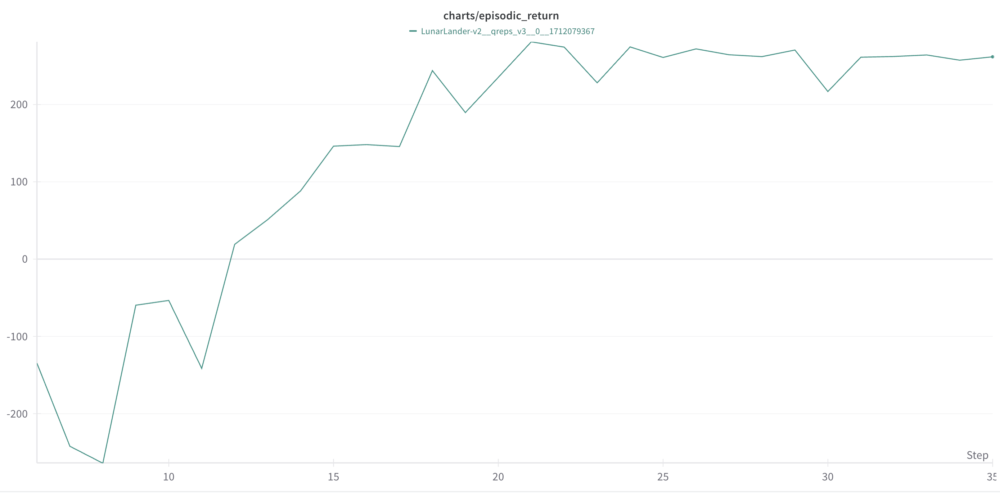
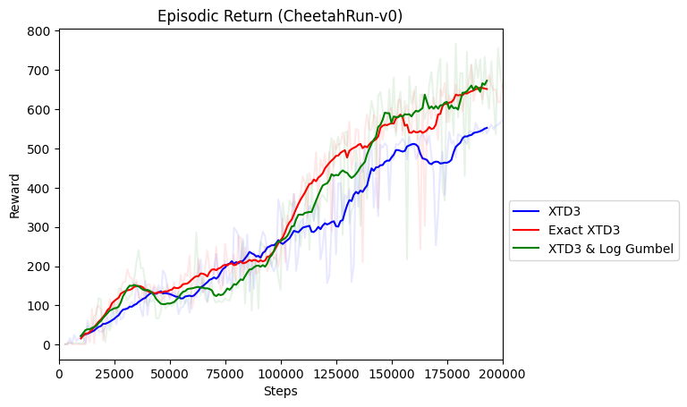

## About this work (in progress)
A study of regularized reinforcement learning algorithms from both a MaxEntRL and a Linear Programming framework. Specially studying the implementation of the QREPS algorithm in large scale environments using DNNs.

In main, you will find the three main algorithms I'm currently working on.

### Usage

```bash
poetry install
poetry run python algos/qreps/qreps_main.py \
    --seed 1 \
    --env-id CartPole-v0 \
    --total-timesteps 50000

tensorboard --logdir runs
```

To use experiment tracking with wandb, run
```bash
wandb login # only required for the first time
poetry run python algos/qreps/qreps_main.py \
    --seed 1 \
    --env-id CartPole-v0 \
    --total-timesteps 50000 \
    --track \
    --wandb-project-name qrepstest
```

### Provisional Results:
### QREPS
Fast convergence in LunarLander and CartPole (for now).
##### CartPole-v1



https://github.com/niicovila/Q-Reps/assets/76247144/4faa3bb3-72bb-4efd-b046-dd61b7bc2589


##### LunarLander-v2



https://github.com/niicovila/Q-Reps/assets/76247144/9d9dafac-3cb7-447f-8b2c-9820b5701f5a


### XPPO


### XSAC


### XTD3


